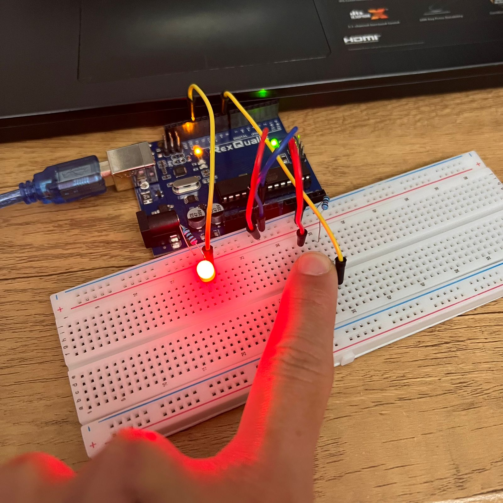
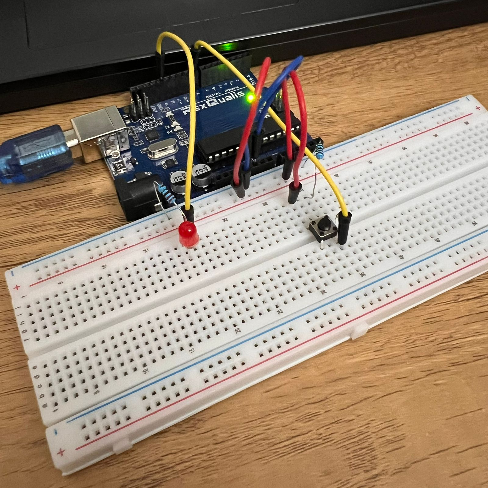

# Led Controladoo Por Boton
## Juan Pablo Rosales - 2025
### Descripción
Proyecto simple de Arduino para encender y apagar un LED con Arduino mediante la pulsación de un bóton  
  
  

### Objetivo
Aprender funcionamiento básico de Arduino y del LED utilizando un boton para prender y apagar el LED
### Materiales
-Arduino Uno  
-LED  
-Bóton  
-Resistencia 10kΩ  
-Resistencia 220Ω  
-Cables  
-Protoboard  

### Código
**Archivo Principal:** led_boton.ino  
int led = 13;  //Pin digital donde está conectado el LED  
int boton = 8;  //Pin digital donde está conectado el bóton  
int estadoboton; //Variable para definir el estado del bóton  
  
void setup() {  
  pinMode(led, OUTPUT);  //Configura el LED como salida  
  pinMode(boton, INPUT);  //Configura el bóton como entrada  
}  
  
void loop() {  
  estadoboton = digitalRead(boton);  //Lee el estado del bóton  
  if (estadoboton == HIGH){  
    digitalWrite(led, HIGH); //Si el bóton esta apretado el LED se prende  
  }  
  else {  
    digitalWrite(led, LOW);  /Si el bóton no esta apretado el LED se apaga  
  }  
}  

### Código Toggle  
    int led = 13; //pin digital al que esta conectado el led
    int boton = 8; //pin digital al que esta conectado el bóton
    int estadoboton; //variable para definir el estado del bóton
    int botonanterior = LOW; //definimos una variable para que el primer estado del bónton este apagado
    int estadoled = LOW; //igual con el led

    void setup() {
      pinMode(led, OUTPUT); //configuramos el led como salida
      pinMode(boton, INPUT); //configuramos el bóton como entrada
    }

    void loop() {
      estadoboton = digitalRead(boton); //el estado del bóton depende de su estado
      if (estadoboton == LOW && botonanterior == HIGH){ //condicional si el estado del bóton esta apagado y el estado anterior estaba prendido

        if(estadoled == LOW){ //y el estado del led esta apagado
          estadoled = HIGH; //definimos el estado del led como prendido
        }
        else 
        {
          estadoled = LOW; //de lo contrario definimos el led como apagado
        }
        digitalWrite(led,estadoled); //prendemos el led
      }
      botonanterior = estadoboton; // cambia el estado del bóton anterior
    }
  
